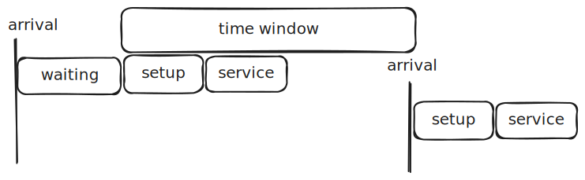

<!-- This file is part of VROOM. -->

<!-- Copyright (c) 2015-2025, Julien Coupey. -->
<!-- All rights reserved (see LICENSE). -->

This file describes the `vroom` API.

Contents:
- [Solving mode](#solving-mode)
- [Input format](#input)
- [Output format](#output)
- [Examples](#examples)

**Notes**:
- the expected order for all coordinates arrays is `[lon, lat]`
- all timings are in seconds
- all distances are in meters
- a `time_window` object is a pair of timestamps in the form `[start, end]`
  (both ends are inclusive)
- deprecated keys are crossed out
- `cost` values in output are the one used internally in the optimization objective
- a "task" is either a job, a pickup or a delivery

# Solving mode

## Default VRP

The default solving mode takes as input the description of a vehicle
routing problem and outputs a set of routes matching all constraints.

## Plan mode

Activated using `-c`, this mode aims at choosing ETA for all route
steps. It takes the same input format augmented with a description of
the expected route for each vehicle. All constraints in input
implicitly become soft constraints. The output is a set of routes
matching the expected description while minimizing timing violations
and reporting all constraint violations.

# Input

The problem description is read from standard input or from a file
(using `-i`) and should be valid `json` formatted as follow.

| Key         | Description |
|-----------|-----------|
| [`jobs`](#jobs) |  array of `job` objects describing the places to visit |
| [`shipments`](#shipments) |  array of `shipment` objects describing pickup and delivery tasks |
| [`vehicles`](#vehicles) |  array of `vehicle` objects describing the available vehicles |
| [[`matrices`](#matrices)] | optional description of per-profile custom matrices |
| ~~[`matrix`]~~ | optional two-dimensional array describing a custom matrix |

## Jobs

A `job` object has the following properties:

| Key         | Description |
| ----------- | ----------- |
| `id` | integer |
| [`description`] | a string describing this job |
| [`location`] | coordinates array |
| [`location_index`] | index of relevant row and column in custom matrices |
| [`setup`] | job setup duration (defaults to 0) |
| [`service`] | job service duration (defaults to 0) |
| [`setup_per_type`] | object mapping vehicle types to job setup duration values |
| [`service_per_type`] | object mapping vehicle types to job service duration values |
| ~~[`amount`]~~ | ~~an array of integers describing multidimensional quantities~~ |
| [`delivery`] | an array of integers describing multidimensional quantities for delivery |
| [`pickup`] | an array of integers describing multidimensional quantities for pickup |
| [`skills`] | an array of integers defining mandatory skills |
| [`priority`] | an integer in the `[0, 100]` range describing priority level (defaults to 0) |
| [`time_windows`] | an array of `time_window` objects describing valid slots for job service start |

An error is reported if two `job` objects have the same `id`.

## Shipments

A `shipment` object has the following properties:

| Key         | Description |
| ----------- | ----------- |
| `pickup` | a `shipment_step` object describing pickup |
| `delivery` | a `shipment_step` object describing delivery |
| [`amount`] | an array of integers describing multidimensional quantities |
| [`skills`] | an array of integers defining mandatory skills |
| [`priority`] | an integer in the `[0, 100]` range describing priority level (defaults to 0) |

A `shipment_step` is similar to a `job` object (expect for shared keys already present in `shipment`):

| Key         | Description |
| ----------- | ----------- |
| `id` | integer |
| [`description`] | a string describing this step |
| [`location`] | coordinates array |
| [`location_index`] | index of relevant row and column in custom matrices |
| [`setup`] | task setup duration (defaults to 0) |
| [`service`] | task service duration (defaults to 0) |
| [`setup_per_type`] | object mapping vehicle types to task setup duration values |
| [`service_per_type`] | object mapping vehicle types to task service duration values |
| [`time_windows`] | an array of `time_window` objects describing valid slots for task service start |

An error is reported if two `delivery` (resp. `pickup`) objects have the same `id`.

## Vehicles

A `vehicle` object has the following properties:

| Key         | Description |
| ----------- | ----------- |
| `id` | integer |
| [`profile`] | routing profile (defaults to `car`) |
| [`description`] | a string describing this vehicle |
| [`start`] | coordinates array |
| [`start_index`] | index of relevant row and column in custom matrices |
| [`end`] | coordinates array |
| [`end_index`] | index of relevant row and column in custom matrices |
| [`capacity`] | an array of integers describing multidimensional quantities |
| [`costs`] | a `cost` object defining costs for this vehicle |
| [`skills`] | an array of integers defining skills |
| [`type`] | a string describing this vehicle type |
| [`time_window`] | a `time_window` object describing working hours |
| [`breaks`] | an array of `break` objects |
| [`speed_factor`] | a double value in the range `(0, 5]` used to scale **all** vehicle travel times (defaults to 1.), the respected precision is limited to two digits after the decimal point |
| [`max_tasks`] | an integer defining the maximum number of tasks in a route for this vehicle |
| [`max_travel_time`] | an integer defining the maximum travel time for this vehicle |
| [`max_distance`] | an integer defining the maximum distance for this vehicle |
| [`steps`] | an array of `vehicle_step` objects describing a custom route for this vehicle |

A `cost` object has the following properties:

| Key         | Description |
| ----------- | ----------- |
| [`fixed`] | integer defining the cost of using this vehicle in the solution (defaults to `0`) |
| [`per_hour`] | integer defining the cost for one hour of travel time with this vehicle (defaults to `3600`) |
| [`per_task_hour`] | integer defining the cost for one hour of task time (setup + service) with this vehicle (defaults to `0`) |
| [`per_km`] | integer defining the cost for one km of travel time with this vehicle (defaults to `0`) |

Using a non-default `per-hour` value means defining travel costs based
on travel times with a multiplicative factor. So in particular
providing a custom costs matrix for the vehicle is inconsistent and
will raise an error.

A `break` object has the following properties:

| Key         | Description |
| ----------- | ----------- |
| `id` | integer |
| [`time_windows`] | an array of `time_window` objects describing valid slots for break start |
| [`service`] | break duration (defaults to 0) |
| [`description`] | a string describing this break |
| [`max_load`] | an array of integers describing the maximum vehicle load for which this break can happen |

An error is reported if two `break` objects have the same `id` for the same vehicle.

A `vehicle_step` object has the following properties:

| Key         | Description |
| ----------- | ----------- |
| `type` | a string (either `start`, `job`, `pickup`, `delivery`, `break` or `end`) |
| [`id`] | id of the task to be performed at this step if `type` value is `job`, `pickup`, `delivery` or `break` |
| [`service_at`] | hard constraint on service time |
| [`service_after`] | hard constraint on service time lower bound |
| [`service_before`] | hard constraint on service time upper bound |

## Notes

### Task locations

For `job`, `pickup` and `delivery` objects, if custom matrices are
provided:

- `location_index` is mandatory
- `location` is optional but can be set to retrieve coordinates in the
  response

If no custom matrix is provided:

- a `table` query will be sent to the routing engine
- `location` is mandatory
- `location_index` is irrelevant

### `vehicle` locations

- key `start` and `end` are optional for a `vehicle`, as long as at
  least one of them is present
- if `end` is omitted, the resulting route will stop at the last
  visited task, whose choice is determined by the optimization process
- if `start` is omitted, the resulting route will start at the first
  visited task, whose choice is determined by the optimization process
- to request a round trip, just specify both `start` and `end` with
  the same coordinates
- depending on if custom matrices are provided, required fields follow
  the same logic than for `job` keys `location` and `location_index`

### Capacity restrictions

Use amounts (`capacity` for vehicles, `delivery` and `pickup` for
jobs, `amount` for shipments) to describe a problem with capacity
restrictions. Those arrays can be used to model custom restrictions
for several metrics at once, e.g. number of items, weight, volume
etc. A vehicle is only allowed to serve a set of tasks if the
resulting load at each route step is lower than the matching value in
`capacity` for each metric. When using multiple components for
amounts, it is recommended to put the most important/limiting metrics
first.

It is assumed that all delivery-related amounts for jobs are loaded at
vehicle start, while all pickup-related amounts for jobs are brought
back at vehicle end.

### Skills

Use `skills` to describe a problem where not all tasks can be served
by all vehicles. Job skills are mandatory, i.e. a job can only be
served by a vehicle that has **all** its required skills. In other
words: job `j` is eligible to vehicle `v` iff `j.skills` is included
in `v.skills`.

This definition implies in particular that:

- a task without skills can be served by any vehicle;
- a vehicle without skills can only serve tasks with no particular
  need (i.e. without skills as well).

In order to ease modeling problems with no skills required, not
providing a `skills` key default to providing an empty array.

### Task priorities

Useful in situations where not all tasks can be performed, to gain
some control on which tasks are unassigned. Setting a high `priority`
value for some tasks will tend as much as possible to have them
included in the solution over lower-priority tasks.

### Task setup times

Setup times serve as a mean to describe the time it takes to *get
started* for a task at a given location. This models a duration that
should not be re-applied for other tasks following at the same
place. So the total "action time" for a task is `setup + service` upon
arriving at a new location or `service` only if performing a new task
at the previous vehicle location.

### Task times per vehicle type

In a situation where the time it takes to complete a given task is
different depending on which vehicle it is assigned to, it is possible
to override the default `service` duration using
`service_per_type`. For any `vehicle.type` value `t`, the actual
service time for a task is `task.service_per_type[t]`, if provided. In
any situation where `t` is not provided as a key in
`task.service_per_type`, the service time falls back to the usual
`service` value for all vehicles with type `t`.

The exact same applies to `setup` and `setup_per_type`.

### Time windows

The actual start time of a task **must** occur in one of its time
windows. The start time happens:

- potentially after some waiting time, if arrival is strictly before time window start;
- right before setup and service times (those can extend paste the time window end).



It is up to users to decide how to describe time windows:

- **relative values**, e.g. `[0, 14400]` for a 4 hours time window starting at the beginning of the planning horizon. In that case all times reported in output with the `arrival` key are relative to the start of the planning horizon;
- **absolute values**, "real" timestamps. In that case all times reported in output with the `arrival` key can be interpreted as timestamps.

The absence of a time window in input means no timing constraint
applies. In particular, a vehicle with no `time_window` key will be
able to serve any number of tasks, and a task with no `time_windows`
key might be included at any time in any route, to the extent
permitted by other constraints such as skills, capacity and other
vehicles/tasks time windows.

### Vehicle `steps`

#### In plan mode

The `steps` array describes exactly the route ordering that will be
generated in response. The (optional) `service_*` keys for
`vehicle_step` objects are used as additional hard timing constraints.

#### In solving mode

Using `steps` for vehicles in default VRP solving mode is a way to
force starting the search from the matching user-defined solution, if
valid. Unlike the default solving behavior of running several
concurrent searches, this means in particular that a single search
path is followed, starting from the provided solution. Resulting
quality is thus obviously expected to be highly dependent on the
user-defined starting point.

In that context:
- only steps with `type=job`, `pickup` or `delivery` are used to
  decide initial routes ordering
- `service_*` keys are not used

An error is raised if for any of the vehicles the provided `steps`
describe a route that is invalid with regard to any of the
constraints.

## Matrices

The `matrices` object allows to input (non-empty) custom matrices for
each vehicle profile. Each matrix is an array of arrays of unsigned
integers filed under the `profile` key, then under:

- `durations` for a custom travel-time matrix that will be used for
  all checks against timing constraints;
- `distances` for a custom distance matrix (requires also providing
  custom `durations`);
- `costs` for a custom cost matrix that will be used within all route
  cost evaluations.

If `durations` are provided without `distances` and distances are
required (either by `-g` or a non-zero `per_km` cost), then a call to
the routing engine is generated to fetch distances.

Example of describing different matrices for different vehicle
profiles:

```
"matrices": {
    "car": {
        "durations": [[0, 14], [21, 0]]
    },
    "bike": {
        "durations": [[0, 57], [43, 0]]
    }
}
```

If custom matrices are provided for all required vehicle `profile`
values, the `location`, `start` and `end` properties become
optional. Instead of the coordinates, row and column indications
provided with the `*_index` keys are used during optimization.

# Output

The computed solution is written as `json` on standard output or a file
(using `-o`), formatted as follow.

| Key         | Description |
| ----------- | ----------- |
| `code` | status code |
| `error` | error message (present iff `code` is different from `0`) |
| [`summary`](#summary) | object summarizing solution indicators |
| `unassigned` | array of objects describing unassigned tasks with their `id`, `type`, and if provided, `description`, `location` and `location_index` |
| [`routes`](#routes) | array of `route` objects |

## Code

Possible values for the status code are:

| Value         | Status |
| ------------- | ----------- |
| `0` | no error raised |
| `1` | internal error |
| `2` | input error |
| `3` | routing error |

## Summary

The `summary` object has the following properties:

| Key         | Description |
| ----------- | ----------- |
| `cost` | total cost for all routes |
| `routes` | number of routes in the solution |
| `unassigned` | number of tasks that could not be served |
| `setup` | total setup time for all routes |
| `service` | total service time for all routes |
| `duration` | total travel time for all routes |
| `waiting_time` | total waiting time for all routes |
| `priority` | total priority sum for all assigned tasks |
| `violations` | array of `violation` objects for all routes |
| ~~[`amount`]~~ | ~~total amount for all routes~~ |
| [`delivery`] | total delivery for all routes |
| [`pickup`] | total pickup for all routes |
| [`distance`]* | total distance for all routes |

*: provided when using the `-g` flag or passing distance matrices in input.

## Routes

A `route` object has the following properties:

| Key         | Description |
| ----------- | ----------- |
| `vehicle` | id of the vehicle assigned to this route |
| [`steps`](#steps) | array of `step` objects |
| `cost` | cost for this route |
| `setup` | total setup time for this route |
| `service` | total service time for this route |
| `duration` | total travel time for this route |
| `waiting_time` | total waiting time for this route |
| `priority` | total priority sum for tasks in this route |
| `violations` | array of `violation` objects for this route |
| ~~[`amount`]~~ | ~~total amount for jobs in this route~~ |
| [`delivery`] | total delivery for tasks in this route |
| [`pickup`] | total pickup for tasks in this route |
| [`description`] | vehicle description, if provided in input |
| [`geometry`]* | polyline encoded route geometry |
| [`distance`]** | total route distance |

*: provided when using the `-g` flag.
**: provided when using the `-g` flag or passing distance matrices in input.

### Steps

A `step` object has the following properties:

| Key         | Description |
| ----------- | ----------- |
| `type` | a string (either `start`, `job`, `pickup`, `delivery`, `break` or `end`) |
| `arrival` | estimated time of arrival at this step |
| `duration` | cumulated travel time upon arrival at this step |
| `setup` | setup time at this step |
| `service` | service time at this step |
| `waiting_time` | waiting time upon arrival at this step |
| `violations` | array of `violation` objects for this step |
| [`description`] | step description, if provided in input |
| [`location`] | coordinates array for this step (if provided in input) |
| [`location_index`] | index of relevant row and column in custom matrices for this step (if provided in input) |
| [`id`] | id of the task performed at this step, only provided if `type` value is `job`, `pickup`, `delivery` or `break` |
| ~~[`job`]~~ | ~~id of the job performed at this step, only provided if `type` value is `job`~~ |
| [`load`] | vehicle load after step completion (with capacity constraints) |
| [`distance`]* | traveled distance upon arrival at this step |

*: provided when using the `-g` flag.

### Violation

A `violation` object has the following properties:

| Key         | Description |
| ----------- | ----------- |
| `cause` | string describing the cause of violation |
| [`duration`] |  Earliness (resp. lateness) if `cause` is "lead_time" (resp "delay") |

Possible violation causes are:
- "delay" if actual service start does not meet a task time window and is late on a time window end
- "lead_time" if actual service start does not meet a task time window and is early on a time window start
- "load" if the vehicle load goes over its capacity
- "max_tasks" if the vehicle has more tasks than its `max_tasks` value
- "skills" if the vehicle does not hold all required skills for a task
- "precedence" if a `shipment` precedence constraint is not met (`pickup` without matching `delivery`, `delivery` before/without matching `pickup`)
- "missing_break" if a vehicle break has been omitted in its custom route
- "max_travel_time" if the vehicle has more travel time than its `max_travel_time` value
- "max_distance" if the vehicle has a longer travel distance than its `max_distance` value
- "max_load" if the load during a break exceed its `max_load` value

Note on violations: reporting only really makes sense when using `-c`
to choose ETA for custom routes described in input using the `steps`
keys for a `vehicle`. When using regular optimization, violations are
still reported for consistency, but are guaranteed to be "void",
i.e. `violations` arrays are empty.

# Examples

## Using a routing engine (OSRM or Openrouteservice)

- [Input file](example_1.json)
- [Possible output file](example_1_sol.json)

## Using custom matrices

- [Input file](example_2.json)
- [Possible output file](example_2_sol.json)

## Using `-c` to choose ETA and report violations

An example with an over-capacity route and one with lead time and
delays.

- [Input file](example_3.json)
- [Possible output file](example_3_sol.json)
